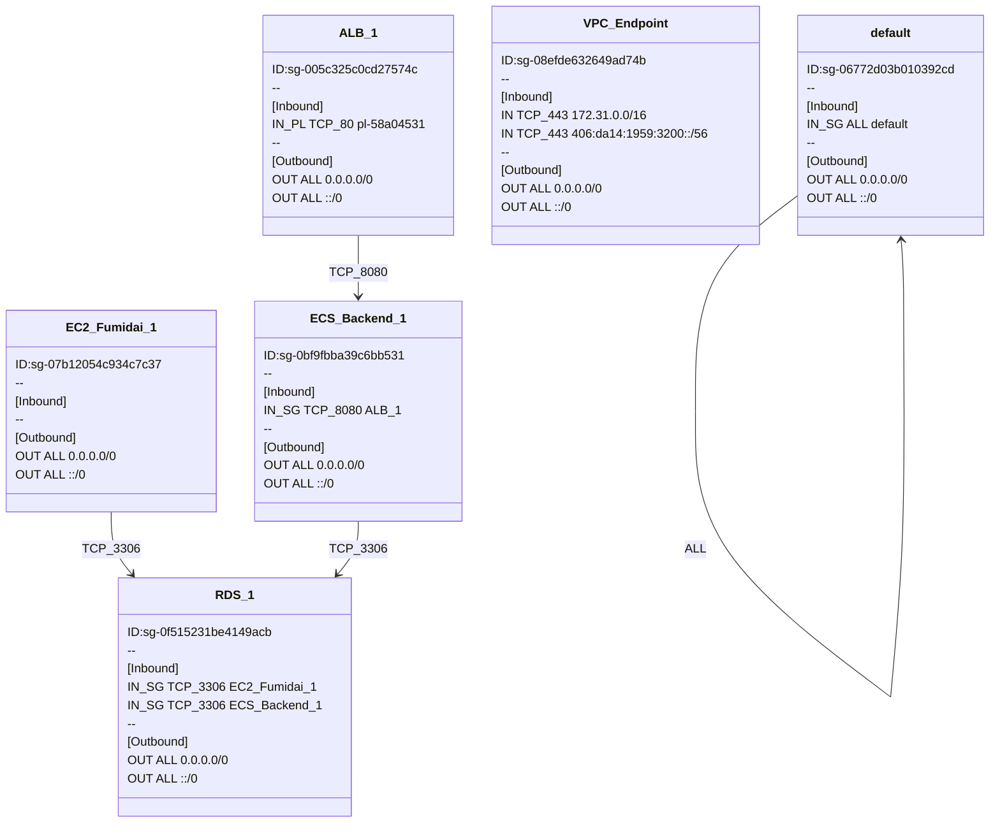

```mermaid
classDiagram
    class ECS_Backend_1 {
        ID:sg-0bf9fbba39c6bb531
        --
        [Inbound]
        IN_SG TCP_8080 ALB_1
        --
        [Outbound]
        OUT ALL 0.0.0.0/0
        OUT ALL ::/0
    }
    class EC2_Fumidai_1 {
        ID:sg-07b12054c934c7c37
        --
        [Inbound]
        --
        [Outbound]
        OUT ALL 0.0.0.0/0
        OUT ALL ::/0
    }
    class ALB_1 {
        ID:sg-005c325c0cd27574c
        --
        [Inbound]
        IN_PL TCP_80 pl-58a04531
        --
        [Outbound]
        OUT ALL 0.0.0.0/0
        OUT ALL ::/0
    }
    class RDS_1 {
        ID:sg-0f515231be4149acb
        --
        [Inbound]
        IN_SG TCP_3306 EC2_Fumidai_1
        IN_SG TCP_3306 ECS_Backend_1
        --
        [Outbound]
        OUT ALL 0.0.0.0/0
        OUT ALL ::/0
    }
    class VPC_Endpoint {
        ID:sg-08efde632649ad74b
        --
        [Inbound]
        IN TCP_443 172.31.0.0/16
        IN TCP_443 406:da14:1959:3200::/56
        --
        [Outbound]
        OUT ALL 0.0.0.0/0
        OUT ALL ::/0
    }
    class default {
        ID:sg-06772d03b010392cd
        --
        [Inbound]
        IN_SG ALL default
        --
        [Outbound]
        OUT ALL 0.0.0.0/0
        OUT ALL ::/0
    }

    ALB_1 --> ECS_Backend_1 : TCP_8080
    EC2_Fumidai_1 --> RDS_1 : TCP_3306
    ECS_Backend_1 --> RDS_1 : TCP_3306
    default --> default : ALL
```
